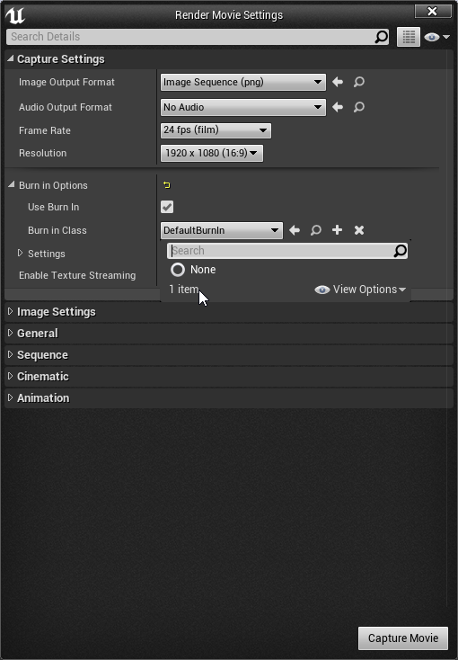
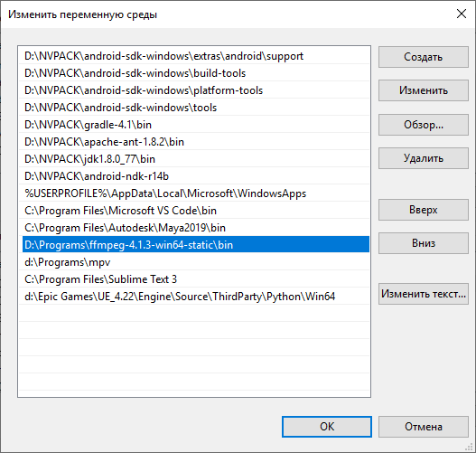
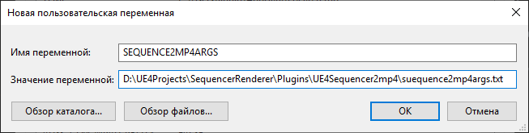

# Sequencer to mp4 renderer

Utility to render currently opened level sequence to video file using [ffmpeg.exe](https://ffmpeg.org/)

## How

There are two steps to get resulting video file.

1) Render to png image sequence
2) Convert image sequence to video file with ffmpeg

After video file generated you will be prompted to remove image sequence. Debug info can be found in output log.

Sequence renderer options are considered, for example if you need custom burnin class, you can assign it as usual.



## Preparations

Main condition to make it work is **ffmpeg.exe** in your **PATH** environment variable. If it is not installed, download [latest release](https://ffmpeg.zeranoe.com/builds/).



## Customize output file (optional)

To customize output file format or codec or whatever ffmpeg behaviour you need:

1) create text file with ffmpeg arguments with following content.

    ```bash
    -start_number @START_FRAME -framerate @CAPTURE_FPS -i image.%04d.png -vcodec mpeg4 -pix_fmt yuv420p -q:v 1 -y @OUT_FILE_NAME
    ```

    where keywords starting with @ symbol will be replaced by correct value, depending on capture
    settings and sequence options. You can add or change whatever valid [ffmpeg arguments](https://ffmpeg.org/ffmpeg.html).

2) Create environment variable `SEQUENCE2MP4ARGS` with path to your `suequence2mp4args.txt`

    

    Name of txt file doesn't matter. Fetching arguments like this is handy if you are inside a studio,
    this file can be placed somewhere in network location.

Feel free to investigate source code!
